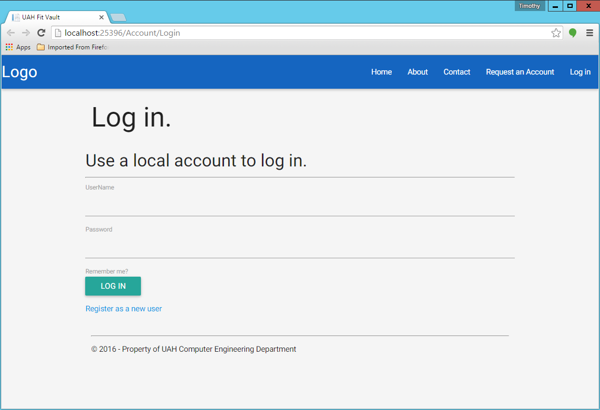

.. _account_creation:

================
Account Creation
================

.. contents:: Table of Contents

There are 4 types of accounts

- patient
- physician
- experiment admin
- system admin

Physician Account
-----------------

Physician accounts can be requested at the home/login page. Click on the "Register as a new user" button.

This will redirect you to a form to fill out for you new physician account.

.. image:: ./images/request_account.png

Once you have filled this out with the appropriate information and selected the "Physician" radio button at the top,
you are ready to submit your request. When you click submit you should be brought to a confirmation page.

You will not be able to login though until a system admin has approved your account.

Experiment Admin Account
------------------------

Experiment Admin accounts are created the same way as the physician accounts. Just make sure to select the "Experiment Administrator"
radio button at the top of the request account page instead of the "Physician" radio button.

.. image:: ./images/request_account.png

Patient Account
---------------

Patient accounts can only be created by their physician. From the physician account's home page click the "CREATE PATIENT"
button at the top right of the screen.

.. image:: ./images/patient_management.png

A popup form should come up with all the information needed to create a patient account.

.. image:: ./images/create_patient.png

After all the information has been filled out, you can click the submit button. If everthing worked, you should get a
confirmation page.

System Admin Account
--------------------

UAHFitVault comes with a system administrator pre-configured. The username is 'fitadmin' and the password is 'Password1!'.
We recommend changing this after the installation before the server is made publicly available.

New System Admin accounts can be created by other System Admin accounts. From the System Admin account home page, click
the "Create Admin" button at the top right corner of the screen.

You will be presented with a form to fill out for the system admin account information.

Once the form is filled out and you click the create button, you should get a confirmation page.

