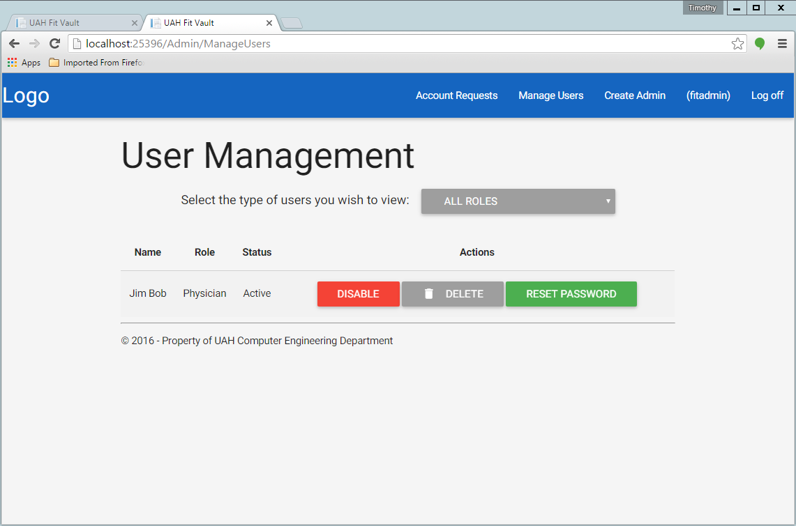

.. _account_deletion:

================
Account Deletion
================

.. contents:: Table of Contents

Accounts can only be deleted by the System Administrator. Login as the system admin and click the "Manage Users" button
at the top right corner of the screen. You should be taken to a page like the one below:

From here you can use the roles filter to help you find the account to delete. Just click the "Delete" button that
corresponds to the account you wish to delete. If the delete worked the account should disappear from the list.