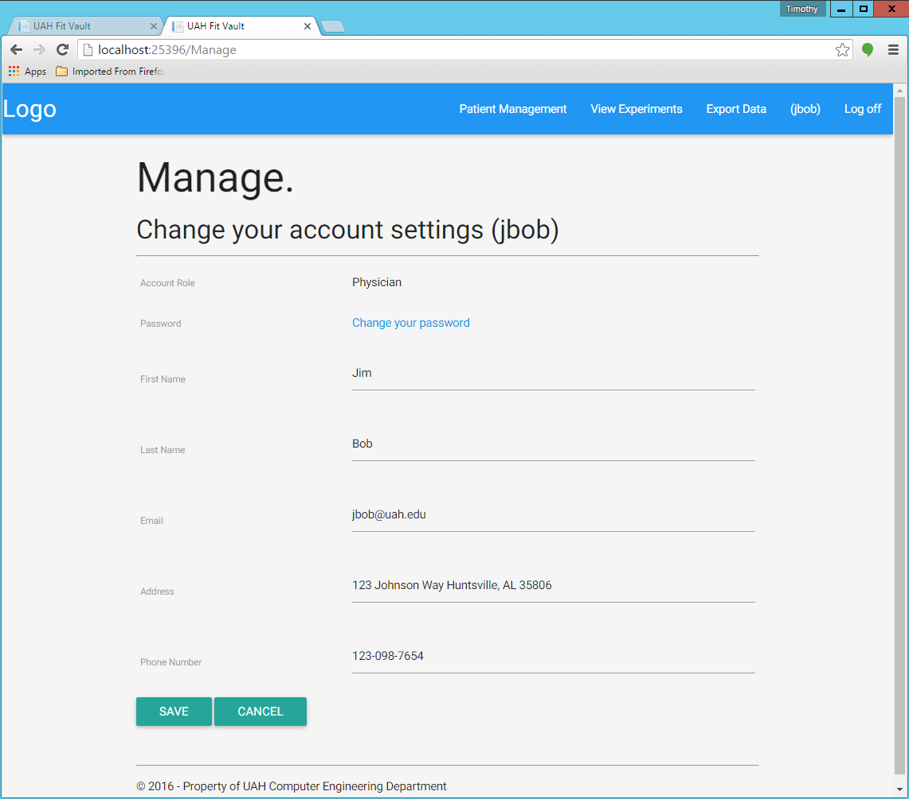
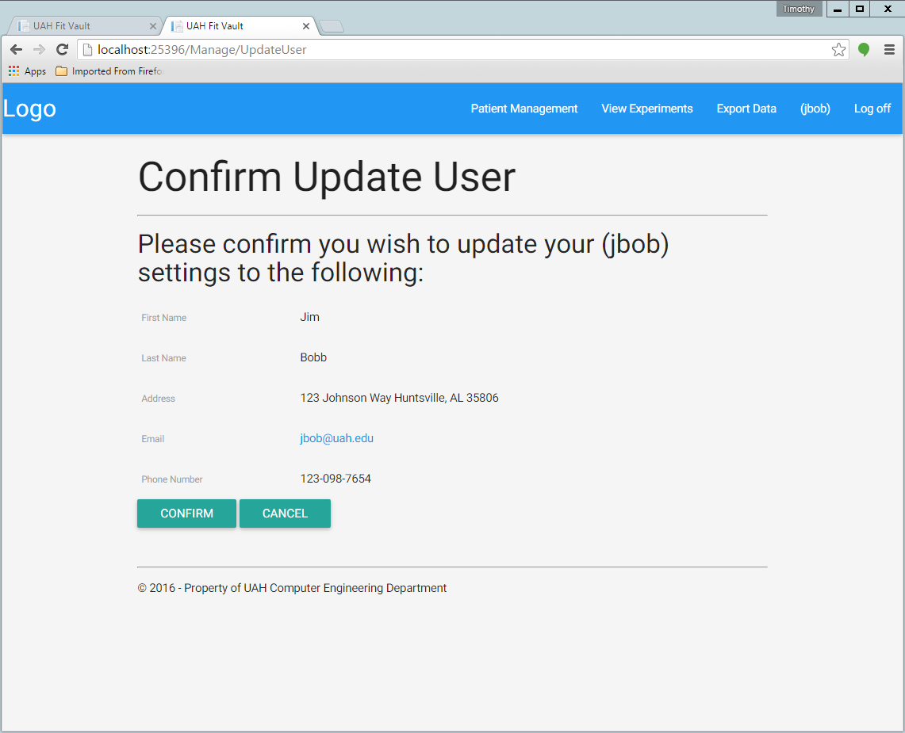

.. _account_edit:

===============
Account Editing
===============

.. contents:: Table of Contents

Users have the ability to edit their account information.

Physician Account
-----------------

To edit a physician account, you must be logged in as the physician. After login, click on the username at the top
right corner of the screen. You should be taken to a page like below:

After you edit the information you wish to edit, click the "save" button at the bottom. You should be taken to a confirmation
page like this:

Click "Confirm" and you changes will be saved.

