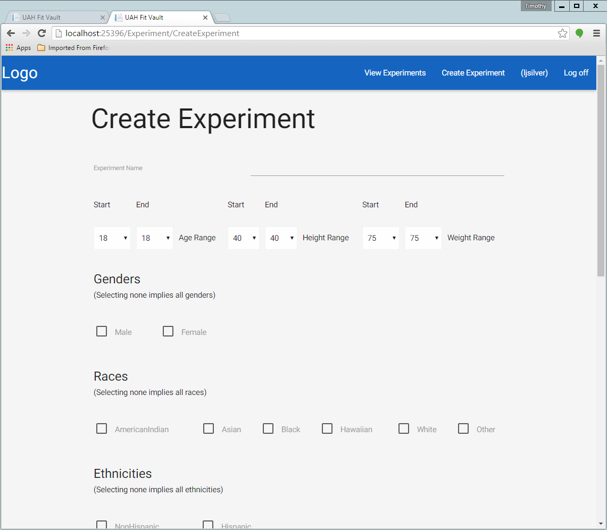
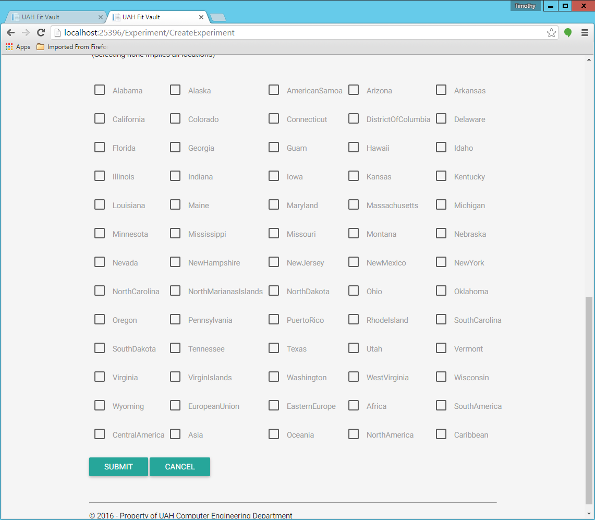
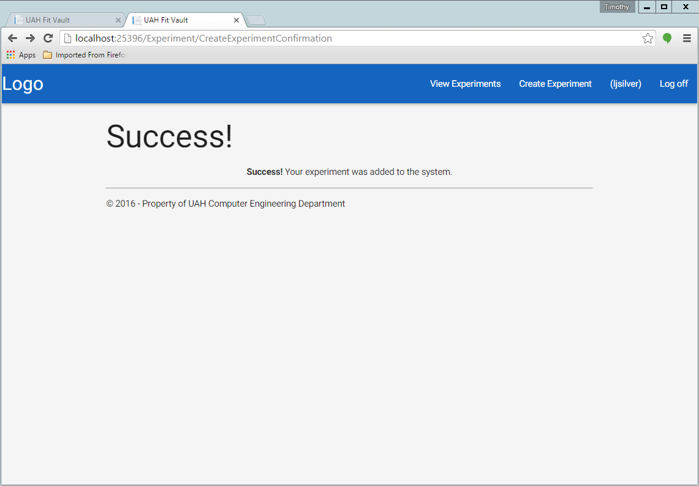

.. _experiment_creation:

===================
Experiment Creation
===================

.. contents:: Table of Contents

Experiments can be created by an Experiment Admin. To create an experiment go to the home page and login with your
experiment admin credentials. Click on the "Create Experiment" button at the top right of the screen. This should
take you to a page like this:

You can then fill out information that will filter out patients for your experiment. Once you have filled out the
form completely to your liking, click the "SUBMIT" button at the bottom of the form. If everything worked right, you
should be presented with a confirmation page like this:

