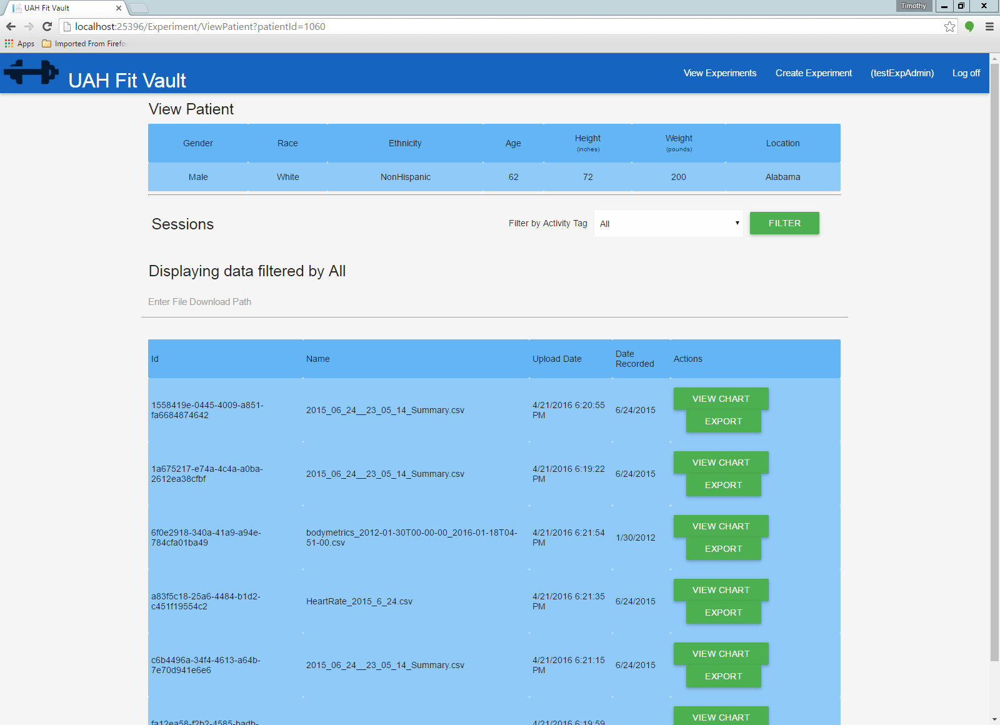
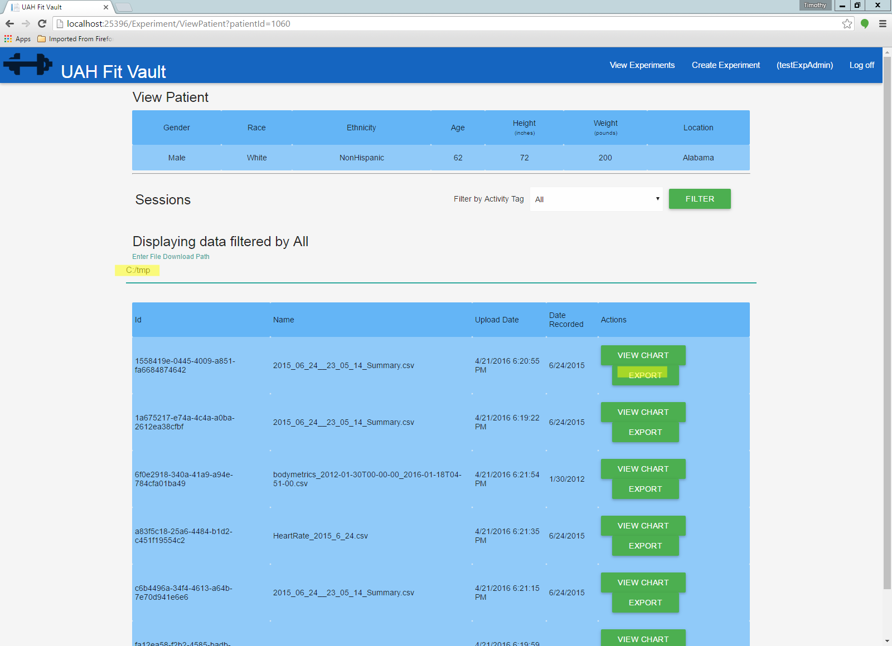

.. _experiment_exportation:

======================
Experiment Exportation
======================

.. contents:: Table of Contents

An Experiment Admin can export experiment data. Login as an experiment administrator. Then click on the "View Experiment"
button.

.. image:: ./images/view_experiments.png

You should then see existing experiments. Click on the "View" button for the experiment you want to export. You should
see the following page:

.. image:: ./images/view_experiments_expadmin_export.png

Next click on the "View Data" button for the account you want to download data from. You should see a page that looks
like this:

You can then fill out the path and click on the "Export" button for the file you want to export.

