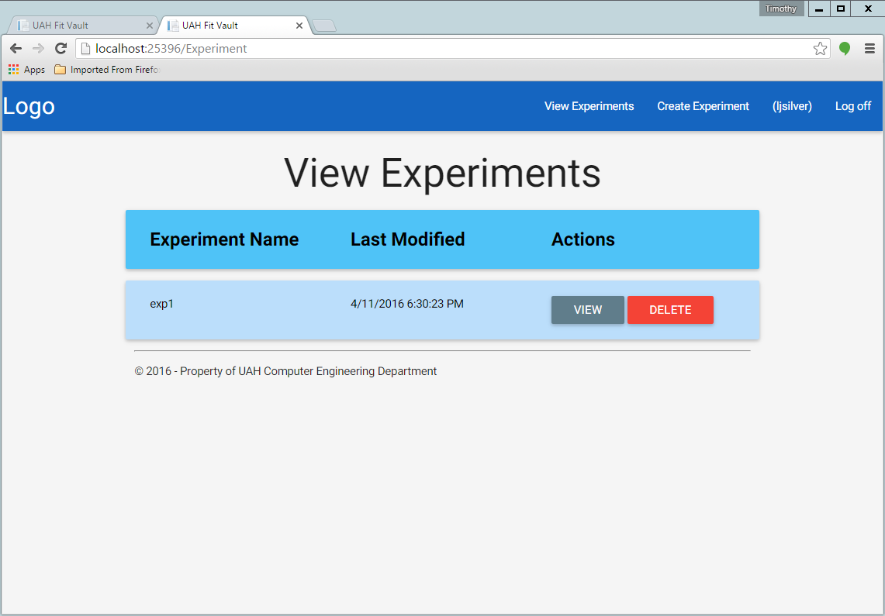

.. _experiment_deletion:

===============
Experiment View
===============

.. contents:: Table of Contents

Both Physicians and Experiment Admins can view experiments.

Experiment Admin
----------------

Once an experiment has been created, login with your experiment admin credentials and click on the "View Experiment" button
at the top right corner of the page. You should be taken to a page that looks like this:

You can then click on the "VIEW" button of the corresponding experiment you want to view.

Physicians
----------

