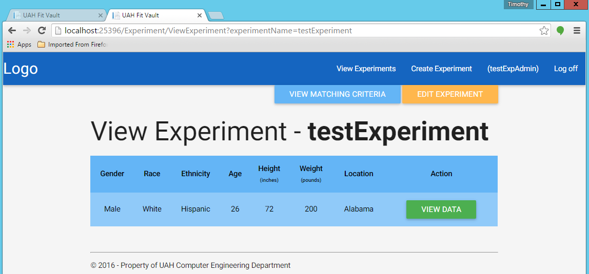
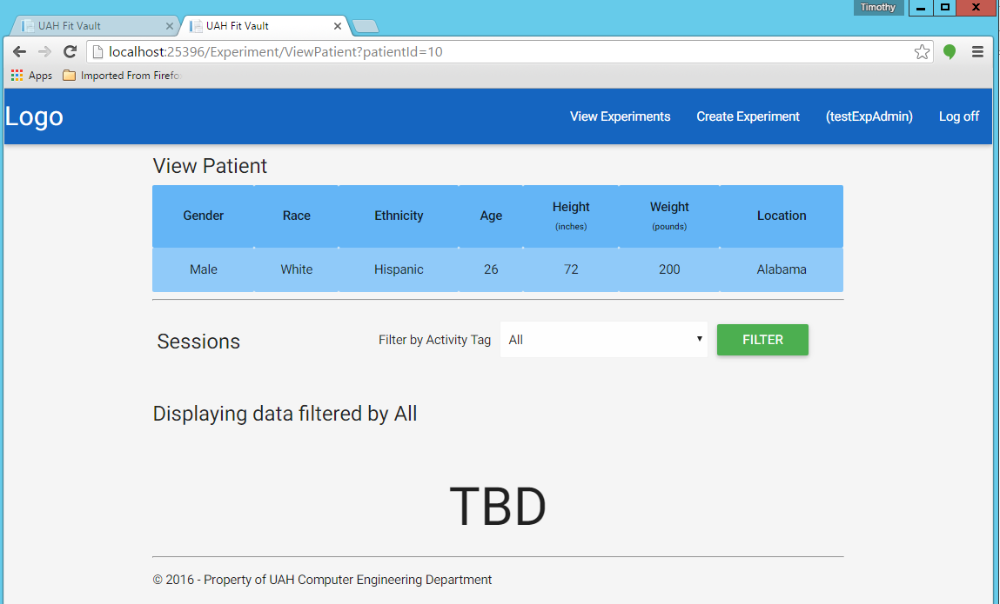
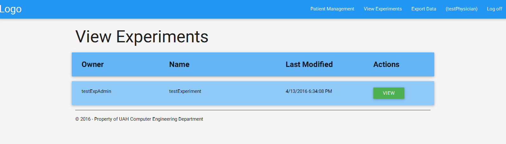
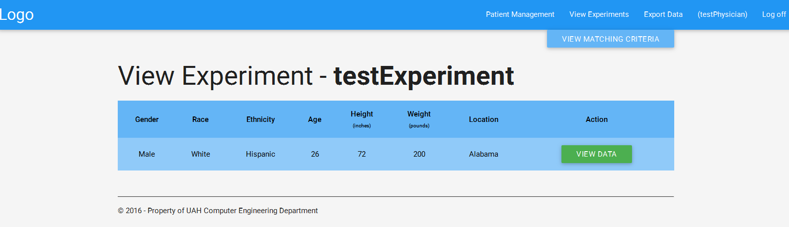
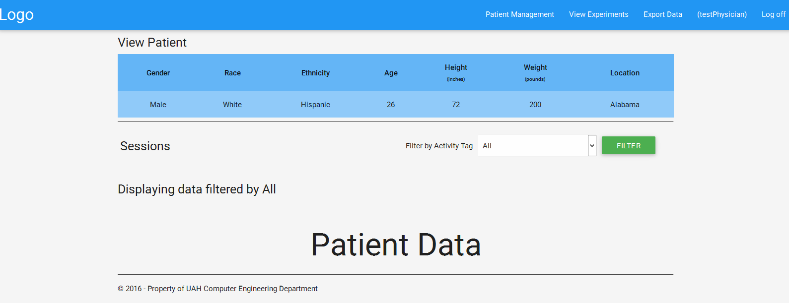

.. _experiment_view:

===============
Experiment View
===============

.. contents:: Table of Contents

Both Physicians and Experiment Admins can view experiments.

Experiment Admin
----------------

Once an experiment has been created, login with your experiment admin credentials and click on the "View Experiment" button
at the top right corner of the page. You should be taken to a page that looks like this:

.. image:: ./images/view_experiments.png

You can then click on the "VIEW" button of the corresponding experiment you want to view. Then this should take you
to to a page that looks like this:

You can now view the data for all the patients that fit into the experiment:

Physicians
----------

Login with your physician credentials and click the "View Experiments" button at the top right corner of the page.
You should be taken to a page that looks like this:

You can then click on the green "VIEW" button to the corresponding experiment you want to view. This should take you
to a page that looks like this:

You can now view the data for all the patients that fit into the experiment:

