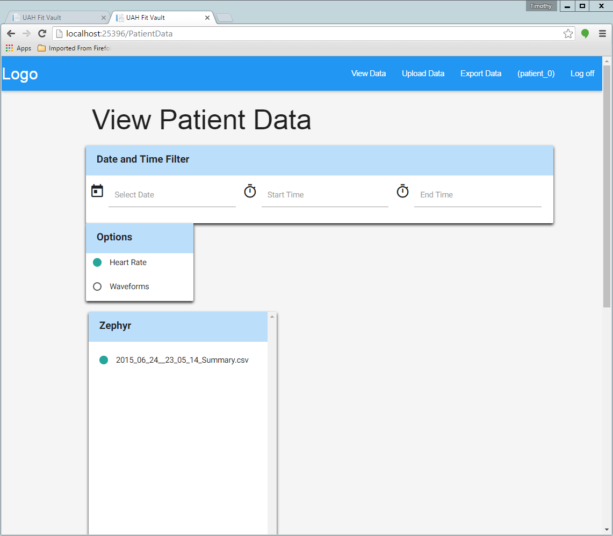

.. _patient_data_view:

=================
Patient Data View
=================

.. contents:: Table of Contents

Both Physicians and Patients can view a patient's data.

Physician
---------

To view patient data as a physician, login with your physician account credentials.

Patient
-------

To view patient data as a patient, login with your patient account credentials. You can then click the "View Data"
button at the top right of the page. You should then be taken to a page that looks like this:

