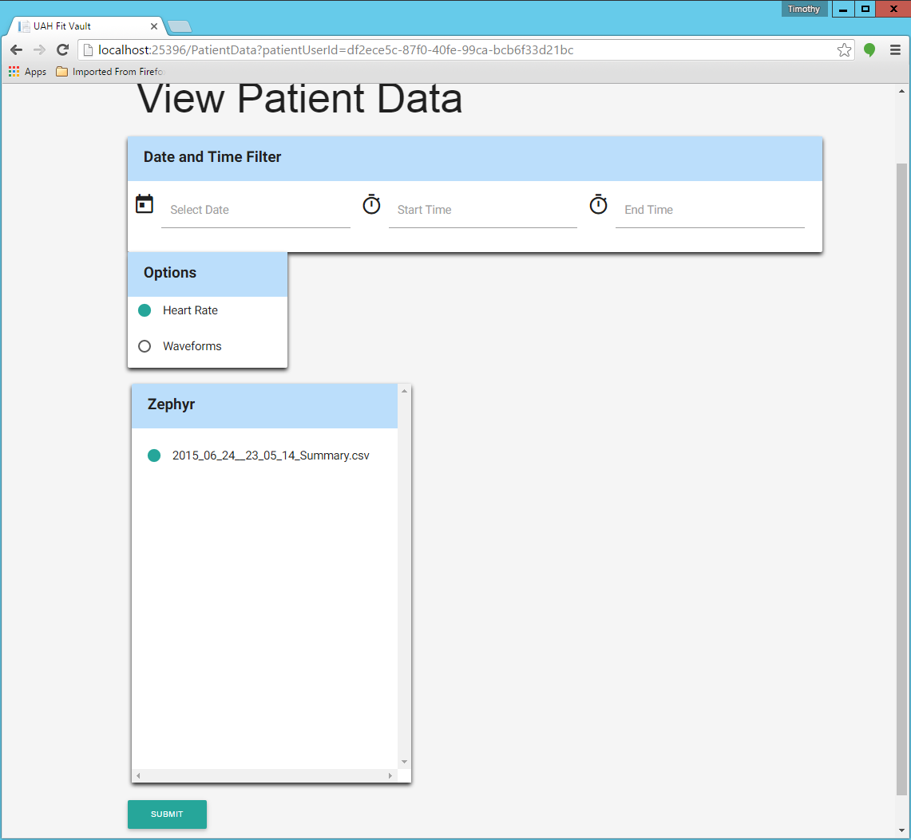

.. _patient_data_view:

=================
Patient Data View
=================

.. contents:: Table of Contents

Both Physicians and Patients can view a patient's data.

.. _view_patient_data_physician:

Physician
---------

To view patient data as a physician, login with your physician account credentials. Click on the "Patient Management"
button at the top right of the page. You should then be taken to a page that looks like this:

.. image:: ./images/patient_management.png

You can then click on the "VIEW PATIENT DATA" button for the corresponding patient who's data you want to view. You
will then be taken to a page that looks like this:

You can then select a date and a start time and end time. Then select the file you want to view. Click the "SUBMIT"
button to display the data at the bottom of the page. It should look like this:

.. image:: ./images/view_patient_data_physician_2.png

Patient
-------

To view patient data as a patient, login with your patient account credentials. You can then click the "View Data"
button at the top right of the page. You should then be taken to a page that looks like this:

.. image:: ./images/view_patient_data.png

You can then select a date and a start time and end time. Then select the file you want to view. Click the "SUBMIT"
button to display the data at the bottom of the page. It should look like this:

.. image:: ./images/view_patient_data_2.png